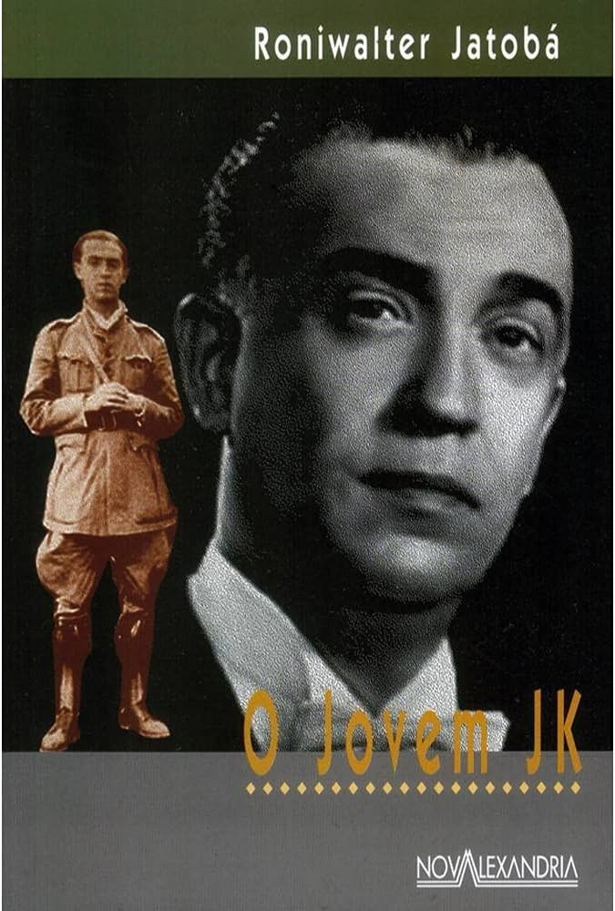

[Go back](../README.md)

## Introduction

> Young JK is a great book to start reading about the history of this interesting Brazilian figure. - Bruno Bevilaqua

  
   
  Thumb

I've read other books about JK and I think this would be the ideal one to begin to understand his life and times. This book is clearly written by an admirer. This author also has a book about Che Guevara, if I'm not mistaken, so he's naturally more to the left, but this doesn't affect the reading in any way.

If you want to have details of JK's government or his political career in detail, I don't recommend this book, it's much more about JK's life story (summarized) than his political decisions and thoughts.

It's the story of someone who left the interior of Minas Gerais, wanted to be a doctor and, thanks to his friendships, gained important public positions and strong political representation. Possibly one of the greatest developmentalists the country has ever seen.

Translated with DeepL.com (free version)

**Book data:**
- **ISBN-13:** 9788574921181
- **ISBN-10:** 8574921181
- **Year:** 2006
- **Pages:** 159
- **Language:** Portuguese
- **Publisher:** Nova Alexandria

Book link in Skoob [here](https://www.skoob.com.br/o-jovem-jk-46198ed50616.html).
