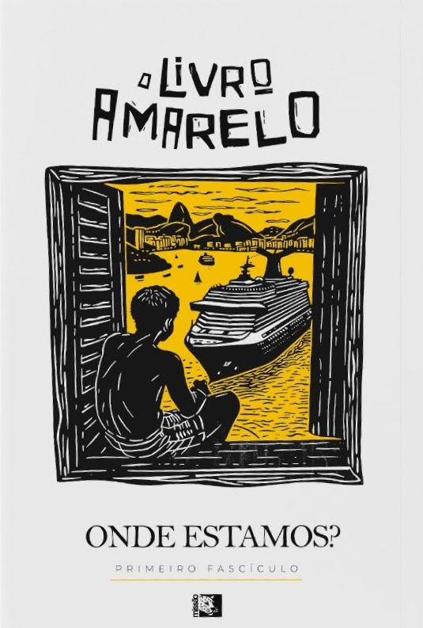

[Go back](../README.md)

## Introduction

> "The Yellow Book - Where are we?" is a great book for those who want to have an overview of the current situation in Brazil, based on the MISSÃO party opinion. - Bruno Bevilaqua

  
   
  Thumb

How is Brazil today?

The book is an analysis of the results of the research groups of the MISSÃO party, a party formed by members of the MBL (Movimento Brasil Livre).
It's a vision of Brazil today, using Neymar's famous cruise ship as a basis to allude to the problems we face. Cultural, political and even external interference (in the case of the environment).

Personally, I see the culture of favelisation as one of the biggest problems they address, but among these there are others, such as the Americans and Europeans trying to curb our agriculture based on environmentalist fallacies or concerns that we have that are worthy of first world countries, when we don't even have basic sanitation.

A great book if you want to get to know the MISSÃO party's vision of Brazil and what many of its future candidates will be fighting for.

Translated with DeepL.com (free version)

**Book data:**
- **ISBN-13:** 7893095268553
- **ISBN-10:** 3095268556
- **Year:** 2024
- **Pages:** 124
- **Language:** Portuguese
- **Publisher:** Editora Missão

Book link in Skoob [here](https://www.skoob.com.br/o-livro-amarelo-122453417ed122454639.html).
