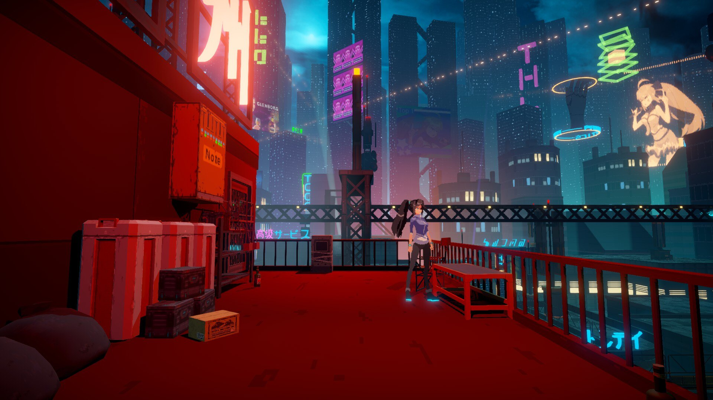
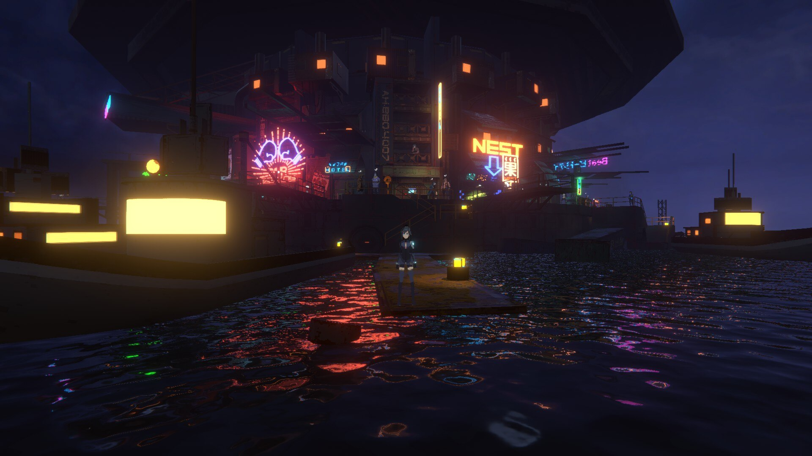
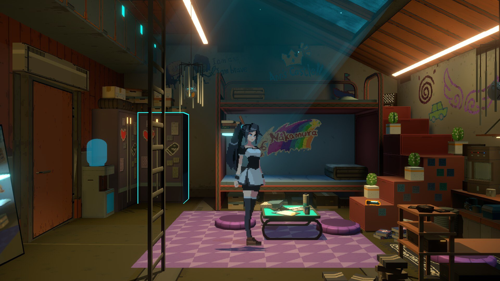
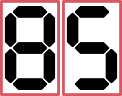

# Anno: Mutationem

[Go back](../README.md)

## Introduction

> ANNO: Mutationem mixes a very good story with a lively, diverse world and satisfying combat gameplay. - Bruno Bevilaqua

  
   
  Logo - Source: Anno: Mutationem na Steam

## A common universe

I'm not going to comment on the game's story and plot here, but it's definitely something positive about the game and a very different story with lots of surprises.

The universe of ANNO: Mutationem can be treated as something ordinary, it's a cyberpunk standard, cities with a high level of technology and extremely poor parts with large amounts of technology, because of this the setting is incredibly good and satisfying. The fact that the game is a mixture of 2d and 3d makes the visuals very interesting, even though all the fights are 2d.

  
   
  City - Source: Author

## A varied fight, but that's about it

As for combat, there are a variety of moves and different weapons that you acquire during the gameplay, and you can upgrade these weapons or buy new ones in the game's stores. The variation in combat and weapons is more of an aesthetic aspect of the game and not “necessary” as you can play practically the whole game with the weapon you prefer without too many problems.

There are different bosses in the gameplay, each with a different and very interesting fighting mechanic, but they are not really memorable fights; I, for example, remember the fights in the fighting arena much more than the bosses in the game.

  
   
  Fighting arena - Source: Author

## An oddity

Putting all the elements of ANNO: Mutationem together, it's possible to conclude that the game has an air of strangeness about it, as it tries to bring together various elements that are known and “loved” by the community, such as varied combat, mixed 2d and 3d gameplay, varied weapons, female characters in a Lara Croft and Bayonetta style and a futuristic neon environment that doesn't lose its “Cozy” feel.

  
   
  A room - Source: Author

## Finally, a verdict

ANNO: Mutationem has several elements that are very cool, but the game feels like it could have more content, it's as if all these elements are just a taste of what the game could have been or could be (with updates). But that doesn't kill the game, it's still a very good and promising game, and if there were more games in this style, it would certainly be great for gamers.

I liked the game so much that I platinumed it on steam and made a guide to platinuming, go there:
[ANNO: Mutationem - 100% Achievements](https://steamcommunity.com/sharedfiles/filedetails/?id=2863440135)

Translated with DeepL.com (free version)

  The final score from 0 to 100 for ANNO: Mutationem is:
   
  

