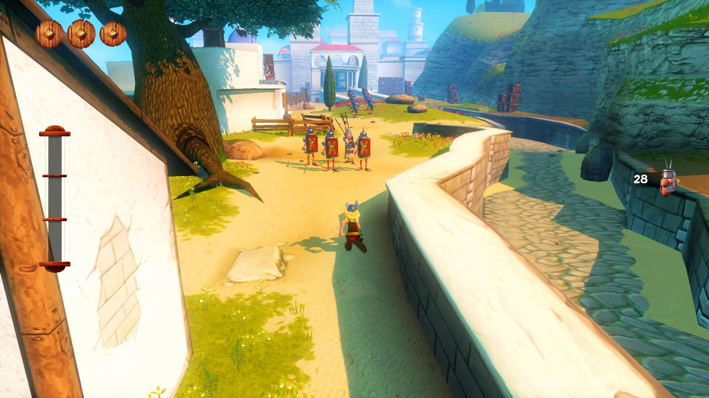
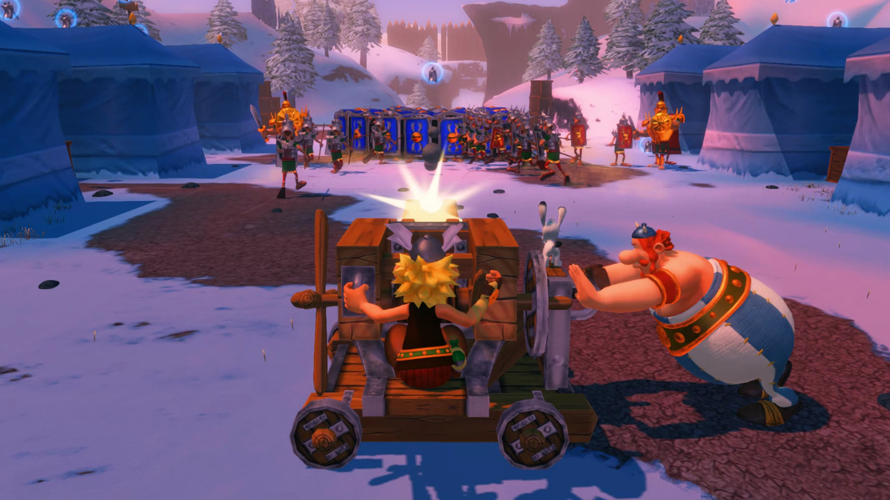
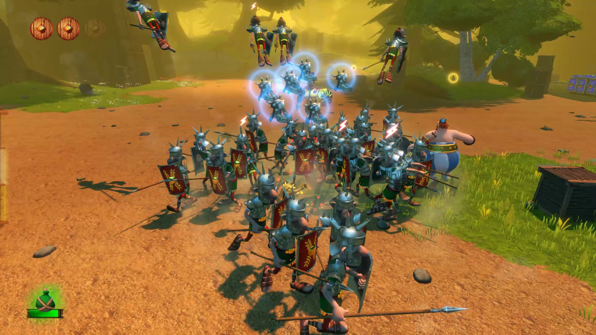
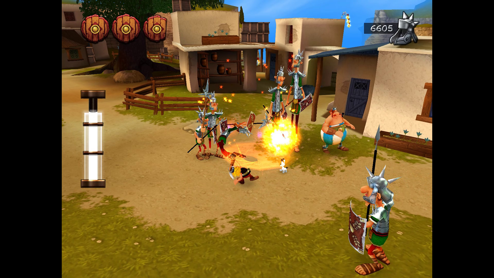
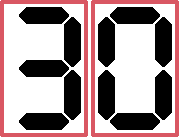

# Asterix & Obelix XXL Romastered

[Go back](../README.md)

## Introduction

> Asterix & Obelix XXL Romastered is an interesting game with fun combat, but it's not enough to make us accept the repetition and FPS drops. - Bruno Bevilaqua

  
   
  Logo - Source: Asterix & Obelix XXL Romastered

## A good old game

Asterix & Obelix XXL in its day should have been a good game, its essence still remains and what made the game good in the old days too, it deserved a remaster for newer platforms and to introduce these characters to younger generations, and this remaster manages to do that.

  
   
  Asterix waling - Source: Author

The gameplay of collecting helmets and using them as currency is standard in old games, and the maps are slightly repetitive too, but I don't see this as a problem with the game.

  
   
  Using a cannon with both characters - Source: Author

The gameplay variation is surprising for the time, you can play both Asterix and Obelix, the gameplay of both is slightly different.

## Horrible remaster (on Switch)

I've only played the Switch version, this one in particular has very serious FPS (frames per second) problems, very serious indeed.

  
   
  Too much enemies and poor FPS - Source: Author

These problems are particularly prevalent in fights with lots of enemies, which is super common in this game, as there are enemies trying to kill you all the time.

  
   
  Fights - Source: Author

Towards the end of the game I unlocked a hurricane skill (yes, there are skills but they change almost nothing in the gameplay), and there are a series of enemies that must be defeated, using the hurricane it's quite easy to kill them all, but for Siwtch it's difficult, as the FPS is almost zero at certain times.

## Finally, a verdict

Although the game was good for its time (in my opinion) and deserved a remaster, this remaster was awful on the Nintendo Switch, there are examples of _third party_ games on the Switch that perform decently, not so with this one. Unfortunately for me, this really affected the gameplay and that's why I didn't like the game.

Translated with DeepL.com (free version)

  The final score from 0 to 100 for Asterix & Obelix XXL Romastered is:
   
  

