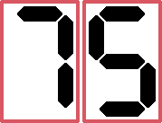

# Super Adventure Island

[Go back](../README.md)

## Introduction

> Super Adventure Island is a great game for the second year of the SNES, but it ages badly towards the end of the console's life. - Bruno Bevilaqua

  
   
  Logo - Source: Super Adventure Island on Wikipedia

## For the time

Looking at it from the point of view of games from 1992 (when I wasn't even born), the game is great, the story is simple, in this case the princess is kidnapped and you run after her, the controls are simple, the gameplay even more so.

  
   
  Initial Screen - Source: Author

## Gameplay

Once you learn how to play the game it's easy, even picking up the skateboard (which is quite random in the game) the controls are easy.

  
   
  End of round 1 - Source: Author

I don't quite understand the idea of skateboarding in this game, it seems a bit out of scope, rather like those outfits you get after completing God of War 2 on PS2.

  
   
  Round 2 - Source: Author

## Finally, a verdict

It's a good game and very interesting for the time, for those who liked it for its nostalgia it's still worth playing.

Translated with DeepL.com (free version)

  The final score from 0 to 100 for Super Adventure Island is:
   
  

