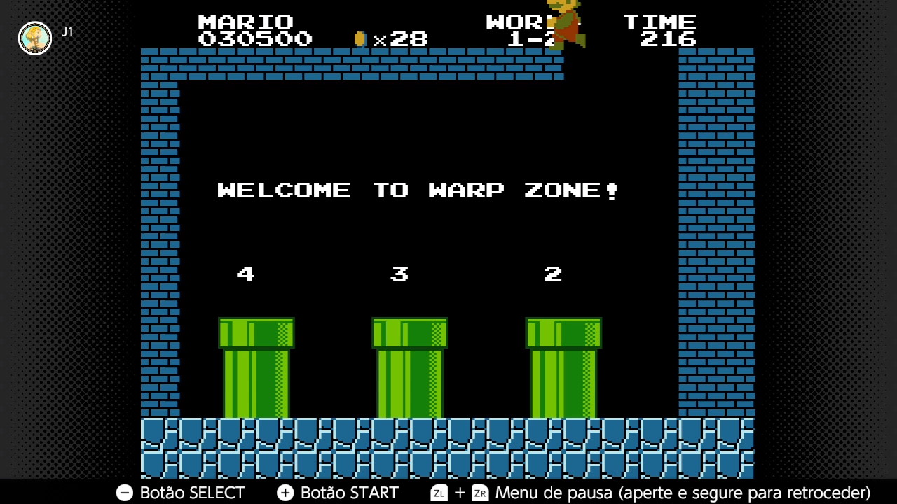
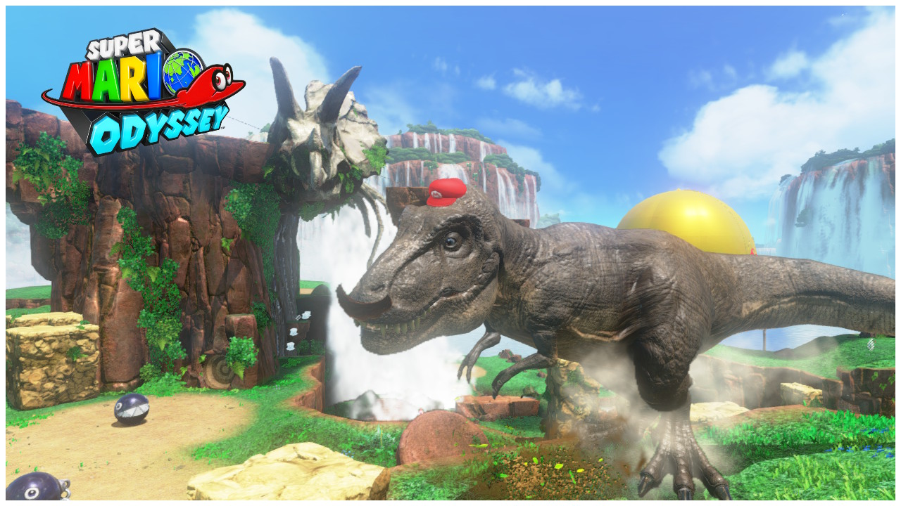
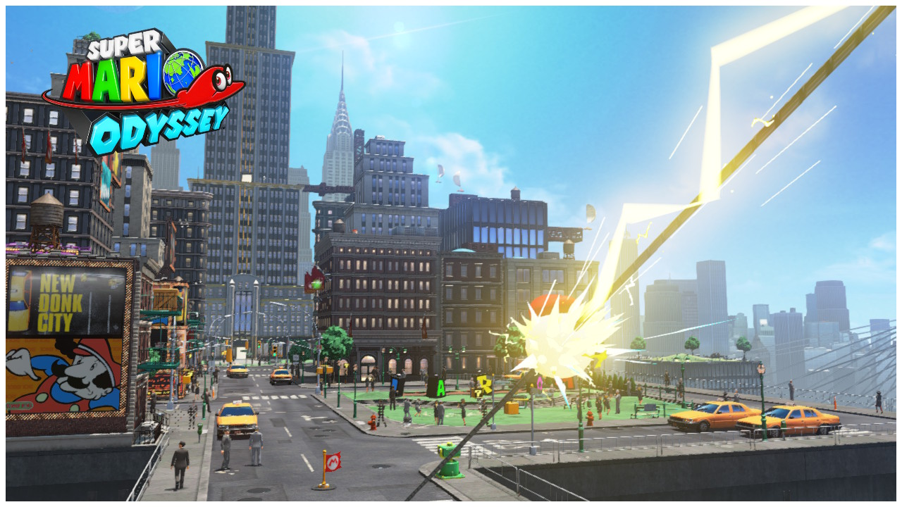
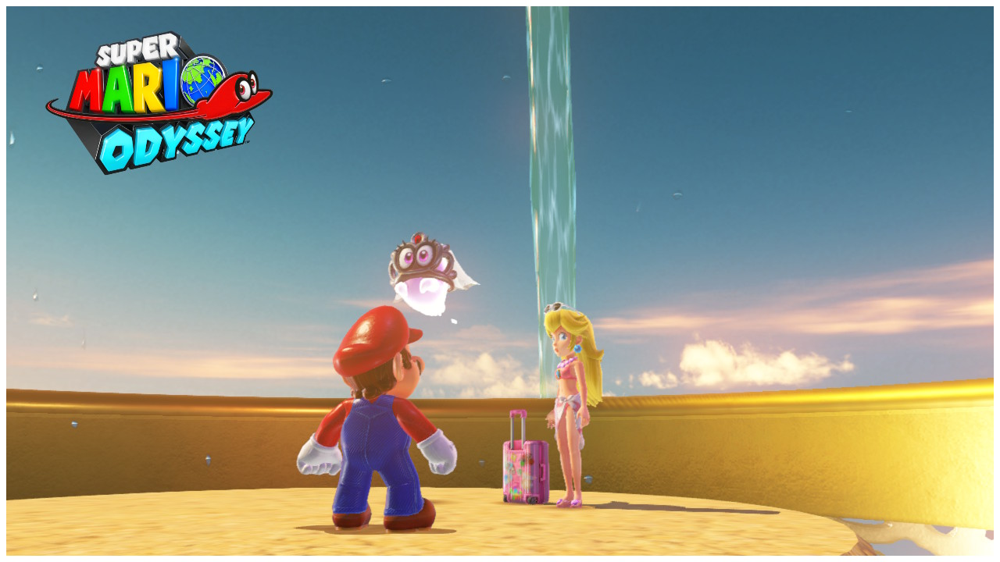
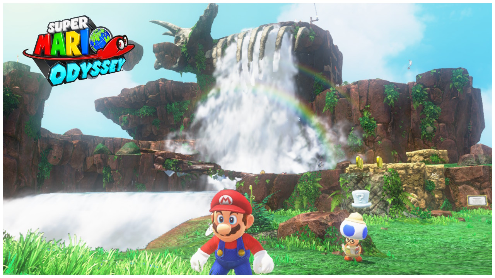
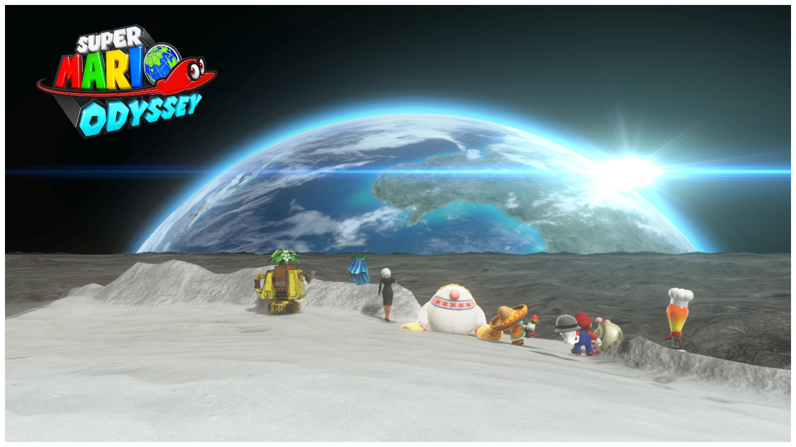
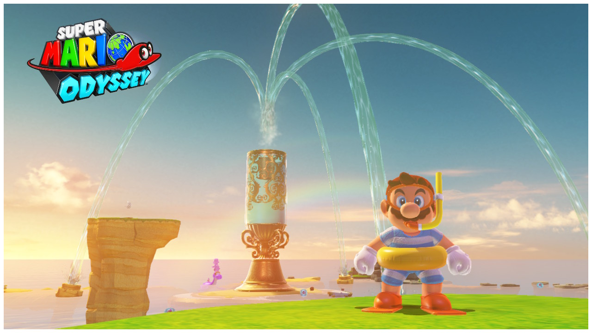
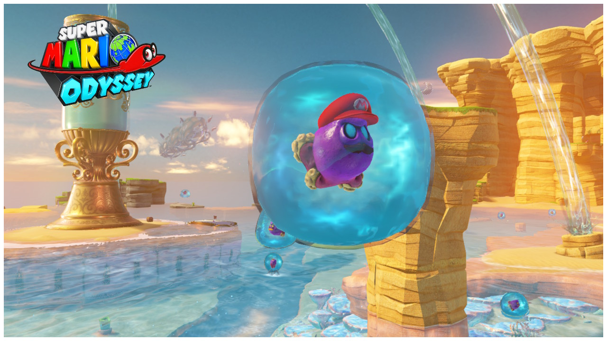
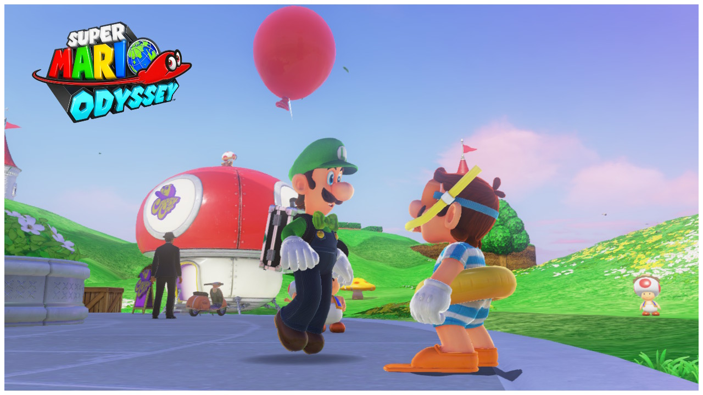
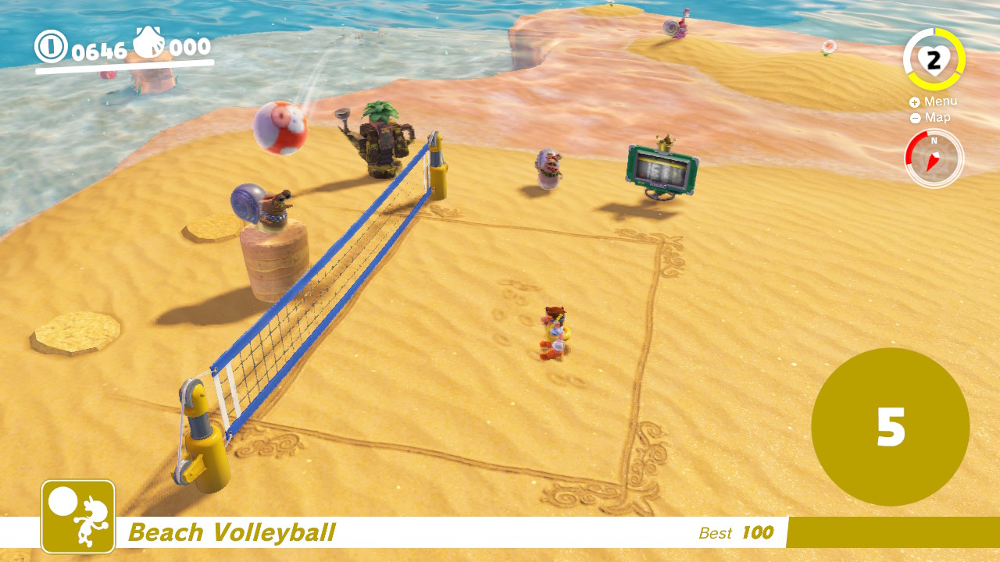

# Super Mario Odyssey

[Go back](../README.md)

## Introduction

> Super Mario Odyssey is yet another Nintendo masterpiece, very fun, innovative and captivating in every aspect of the game, from start to finish. - Bruno Bevilaqua

  
   
  Super Mario Odyssey logo. - Source: <a href="https://www.mariowiki.com">Mario Wiki</a>

## Remembering childhood

Super Mario Odyssey brought back memories of the first video game I ever owned, a Polystation on which I played Super Mario Bros. This game has always been my favorite and for all these years it has held this position alone.

Super Mario Bros is my favorite because it was the game I played the most with my uncle **Ado**, who passed away in 2016. I always played this game with him, between 2004 and 2007, we lived far away from him and sometimes he came to spend time at our house. He taught me back then how to jump over the scenery in world 1 - stage 2 of Super Mario Bros.

  
   
  Super Mario Bros - Warp zone. - Source: Author

So Super Mario Odyssey brought me this feeling of nostalgia and happiness because it had innovative gameplay and a level design as good as Super Mario Bros. Unfortunately Super Mario Odyssy was released in 2017, a year after my uncle passed away and I'm sure he would have loved this game for its exceptional quality.

## A new partner for the journey

Thanks to Mario's new friend, Cappy, he has acquired new abilities, such as interacting with parts of the map or controlling specific enemies to help explore the map or defeat other enemies. This gameplay is unprecedented in the Mario series and has brought an air of novelty to the game along with countless new possibilities.

  
   
   Mario controlling a dinosaur. - Source: Author

  
   
   Mario using a string of light to reach the map. - Source: Author

The reason Cappy joins Mario on this journey is that, as well as Bowser kidnapping Princess Peach (what a novelty!), he has also kidnapped Tiara who is Cappy's sister, so the two of them team up to save Peach and Tiara.

  
   
   Mario, Peach e Tiara. - Source: Author

## The Worlds

The number and variety of worlds in Super Mario Odyssey is astonishing, every time you get enough moons, you immediately want to go to the next world just to get to know it and get a taste of what your next gameplay will be like.

Traveling between worlds is done with the Odyssey, Mario's airship, but he's not the only one with an airship, Bowser and the Broodals (the game's secondary bosses) also have airships.

  
   
  Odyssey, Mario's airship. - Source: <a href="https://www.mariowiki.com">Mario Wiki</a>

Each world has a totally different gameplay, there's a standard world at the start, a volcanic world with a kitchen and food theme, the world of Princess Peach's castle and towards the end of the game, a moon-themed world with gravity effects and even a view of the earth that looks quite beautiful.

  
   
  Initial World - Source: Author

  
   
  Earth View of the lunar world. - Source: Author

Personally, the world I found most beautiful was the Seaside Kingdom because it has an incredible setting. Much of the gameplay takes place underwater and the enemies you can control with Cappy are the most fun in the game.

  
   
  Seaside Kingdom - Source: Author

  
   
  Mario controlling a squid in Seaside kingdom. - Source: Author

Super Mario Odyssey also has a light “online” gameplay, in which you can compare your score with the rest of the world in certain minigames, some of which are a balloon hide-and-seek with luigi in which you have to hide or find a balloon that another player has hidden, a remote control cart race, a volleyball minigame, a jump rope minigame, among others.

  
   
  luigi's minigame - Source: Author

  
   
  Volleyball minigame - Source: Author

This last minigame, jumping rope, we can mention a “problem” with the game, in which it is possible to circumvent the jumping rope minigame with a glitch involving pieces of letters that you move, see below:

  <iframe width="506" height="290" src="https://www.youtube.com/embed/liyNZW8ovnQ?si=64k3dm9loaEf6EGz" title="YouTube video player" frameborder="0" allow="accelerometer; autoplay; clipboard-write; encrypted-media; gyroscope; picture-in-picture; web-share" referrerpolicy="strict-origin-when-cross-origin" allowfullscreen></iframe>

Even some glitches like this one don't hinder the gameplay at all, because as you can see in the video, it's very difficult to execute and sometimes funny things happen, like this one below:

  <iframe width="506" height="290" src="https://www.youtube.com/embed/SIJRKaUioIo?si=NruARouQZlKF0xcb" title="YouTube video player" frameborder="0" allow="accelerometer; autoplay; clipboard-write; encrypted-media; gyroscope; picture-in-picture; web-share" referrerpolicy="strict-origin-when-cross-origin" allowfullscreen></iframe>

## Finally, a verdict

Finally, Super Mario Odyssey for me is one of the best games of all time, but because of the story I told at the beginning, I would put it side by side with Super Mario Bros, because Super Mario Odyssey brought me nostalgia and memories of the feelings that Super Mario Bros created.

The quality of Super Mario Odyssey is worthy of Nintendo, the Japanese company never leaves anything to be desired when it comes to its biggest game series, so Super Mario Odyssey is another one of those games that you **need** to play, even if you've never touched a controller in your life.

  The final score from 0 to 100 for Super Mario Odyssey is:
   
  

