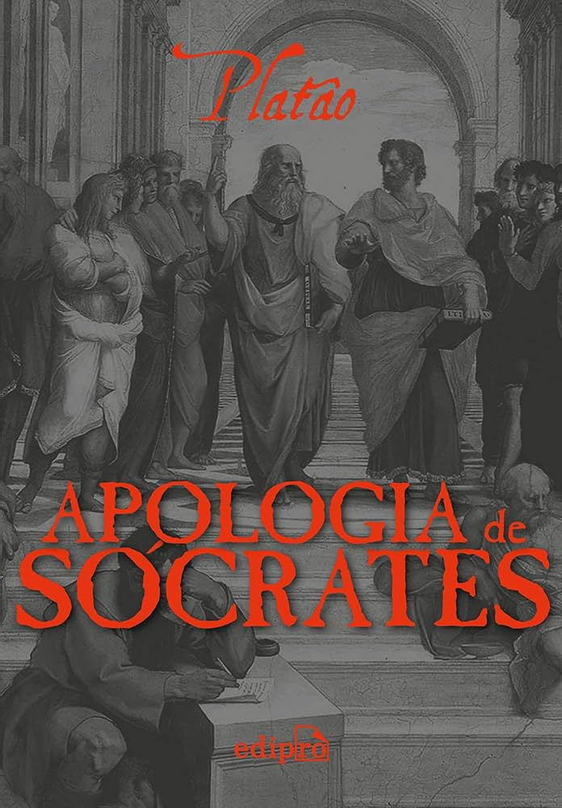

[Voltar](../README.md)

## Introdução

> Apologia de Sócrates traz uma das defesas mais famosas no direito aqui no ocidente, ótimo para iniciar com livros de filosofia. - Bruno Bevilaqua

  
   
  Thumb

Apologia de Socrates é um ótimo livro para quem deseja iniciar com filosofia, pois traz reflexões e pontos simples de entender, a própria fala de Sócrates segundo ele mesmo na transcrição do seu discurso, é simples e fácil de entender.

O livro trata do discurso de defesa de Sócrates, cujas acusações são de não crer nos deuses do olimpo e de corromper a juventude.

Além de indagar e argumentar contra suas acusações de formas distintas, dando exemplos da sua vida e trazendo premissas simples para montar argumentos, Sócrates no fim ainda acaba perguntando se a morte, que é a punição que recebeu, é de fato uma punição e não uma coisa boa.

**Dados do livro:**
- **ISBN-13:** 9788552100669
- **ISBN-10:** 8552100665
- **Ano:** 2019
- **Páginas:** 80
- **Idioma:** português
- **Editora:** Edipro

Link do livro no Skoob [aqui](https://www.skoob.com.br/apologia-de-socrates-968695ed969706.html).
