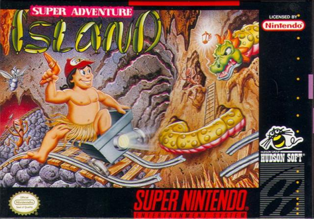
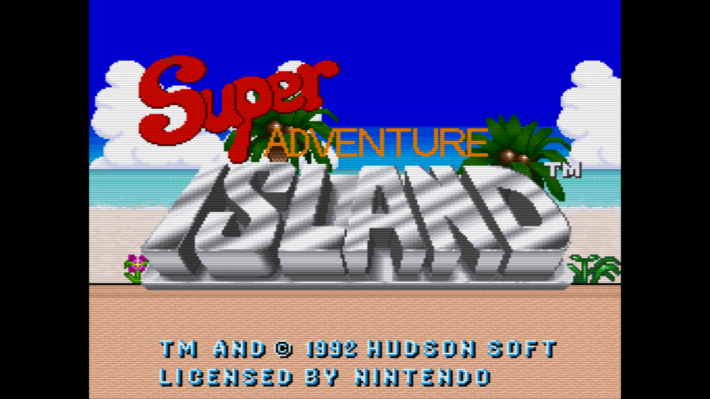
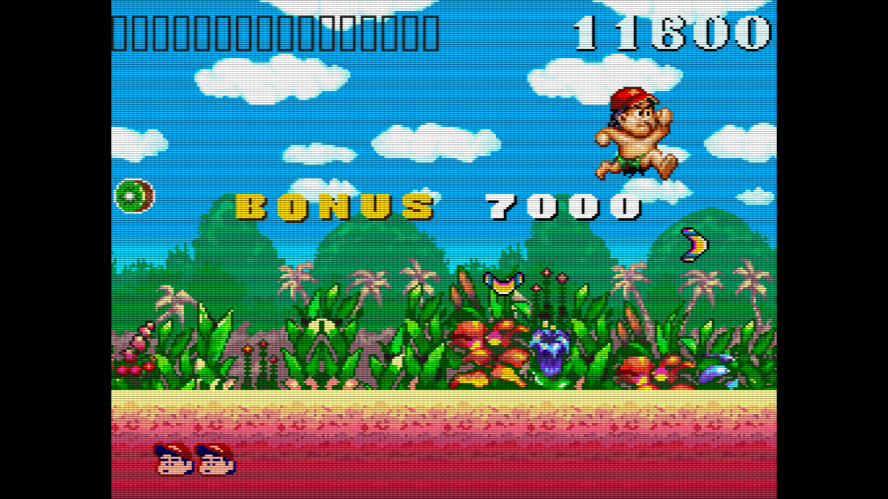
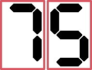

# Super Adventure Island

[Voltar](../README.md)

## Introdução

> Super Adventure Island é um ótimo jogo para o segundo ano do SNES, mas envelhece mal para o final da vida do console. - Bruno Bevilaqua

  
   
  Logo - Fonte: Super Adventure Island na Wikipedia

## Para a época

Analisando pela visão dos jogos de 1992 (que eu não tinha nem nascido), o game é ótimo, a história simples, neste caso princesa é raptada e você corre atrás dela, os controle são simples, a gameplay mais ainda.

  
   
  Tela inicial - Fonte: Autor

## Gameplay

Quando aprende a jogar fica fácil, mesmo pegando o skate (que é algo bem aleatório no game) os controles ficam fáceis.

  
   
  Fim da fase 1 - Fonte: Autor

Não entendi muito bem a ideia do skate neste jogo parece algo fora do escopo, mais ou menos como aquelas roupas que você libera depois de zerar o God of War 2 no PS2.

  
   
  Fase 2 - Fonte: Autor

## Por fim, um veredito

É um bom jogo e muito interessante para a época, para quem gostava pela nostalgia ainda vale a pena jogar.

  A nota final de 0 a 100 para Super Adventure Island é:
   
  

